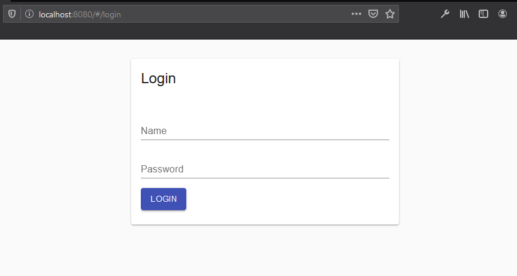
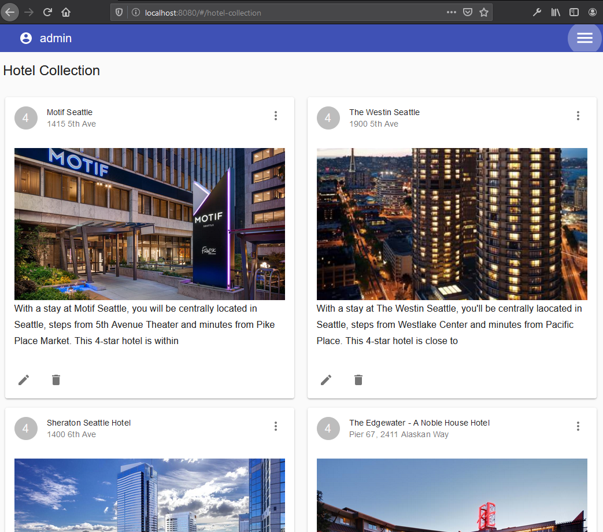
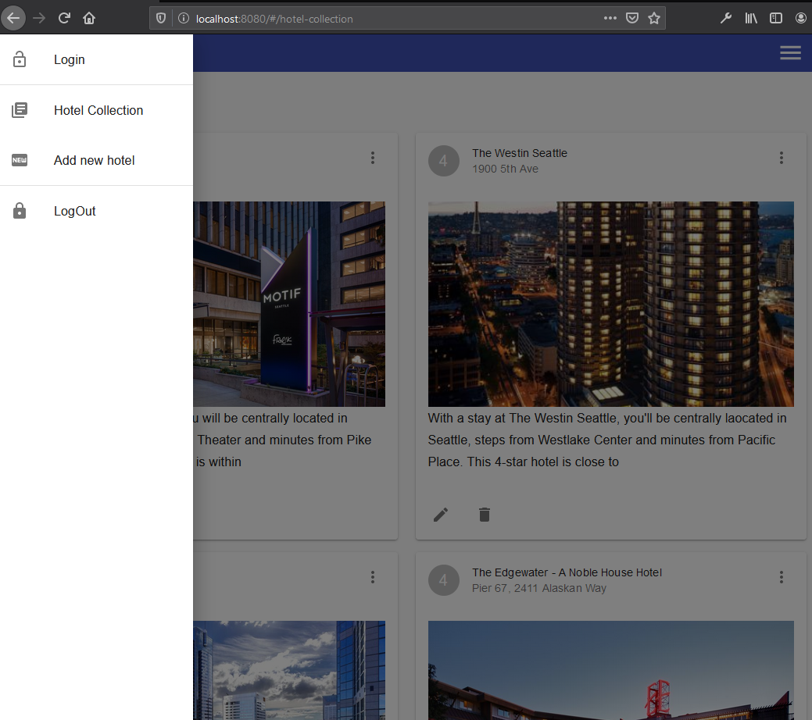
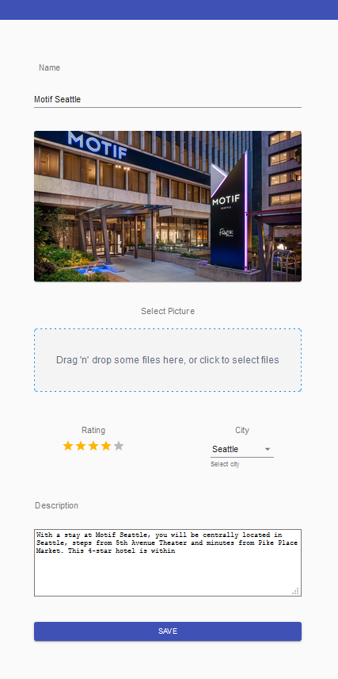

# 4. React Lab. CRUD de Hoteles

El ejercicio consiste en crear un CRUD de los hoteles que nos proporciona la API del servidor de pruebas.
Podemos listar, editar y eliminar aunque esta última función no responde como debería por la configuración del servidor de pruebas.

El ejercicio parte de esta [base del módulo del máster Lemoncode]("https://github.com/Lemoncode/react-lab-sessions/tree/master/day-2/08-rest-api") y se implementa con lo requerido.

Aparte de lo requerido se ha añadido la configuración correspondiente de webpack para producción y de rendimiento.

## Librerias y módulos utilizados:

- Para el diseño se ha utilizado [Material-UI]("https://material-ui.com/).
- Para la carga de imágenes se utiliza el módulo [React-Dropzone]("https://react-dropzone.js.org/).
- Para los formularios utilizamos [React-Final-Form]("https://final-form.org/react");
- La validación de formularios se hace con los frameworks [Fonk]("https://github.com/Lemoncode/fonk") y el módulo [Fonk-Final-Fonk]("https://github.com/Lemoncode/fonk-final-form") de [Lemoncode]("https://lemoncode.net/").
- Para las peticiones http se utiliza la librería [Axios]("https://github.com/axios/axios").

> Notas:

- El directorio `/backend` es donde se encuentra el servidor de pruebas el cual hay que instalar y arrancar de manera individual.

## Imágenes de la aplicación

### Página de Login

### Listado de hoteles

### Menú desplegado

### Editción o creación de hotel

